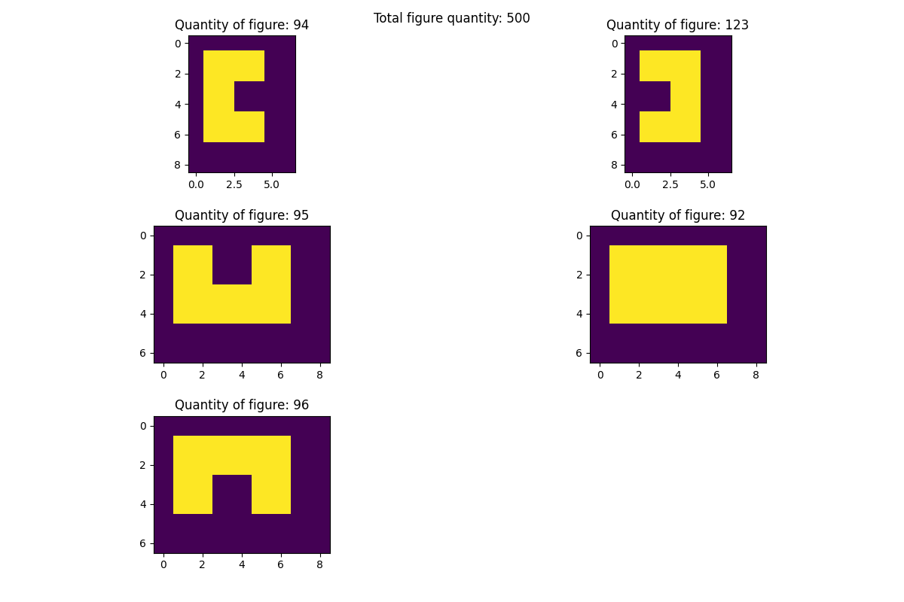

Применяя операции морфологического анализа и соответствующие структурирующие элементы необходимо определить общее количество объектов на бинарном изображении (ps.npy.txt) и количество объектов для каждого вида по отдельности.

Результат:
