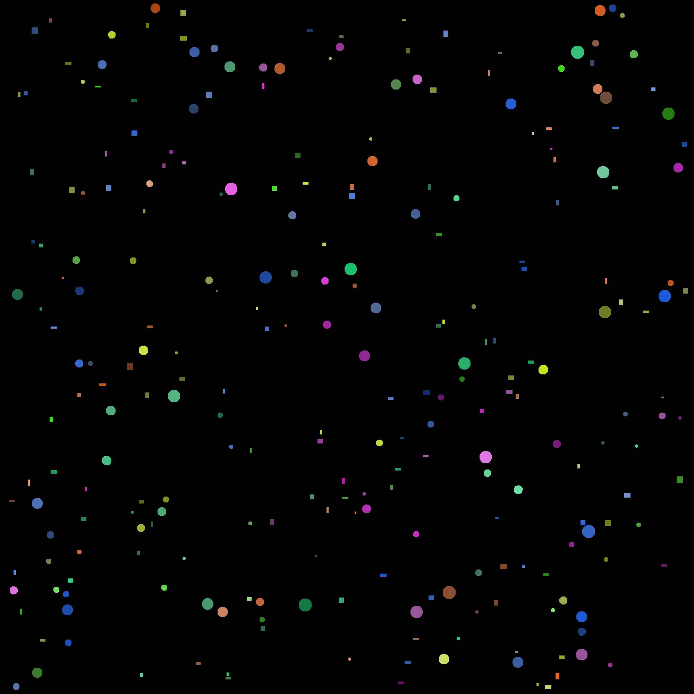
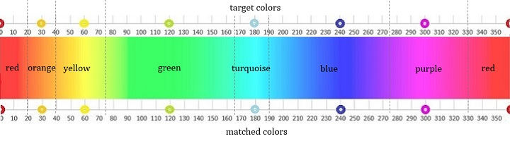

Определить сколько фигур каждого цвета имеется на изображении. Программа должна выдавать общее количество фигур на изображении и отдельно для прямоугольников и кругов количество по цвету.

<h3>Result:</h3>
<pre>
Total number of figures: 257
Rectangles: {
        yellow: 32
        orange: 14
        blue: 29
        purple: 13
        green: 39
        red: 8
}
Circles: {
        red: 4
        blue: 29
        orange: 13
        yellow: 19
        purple: 23
        green: 34
}
</pre>

<h3>Input image:</h3>

    

<h3>HSV scale:</h3>

    

