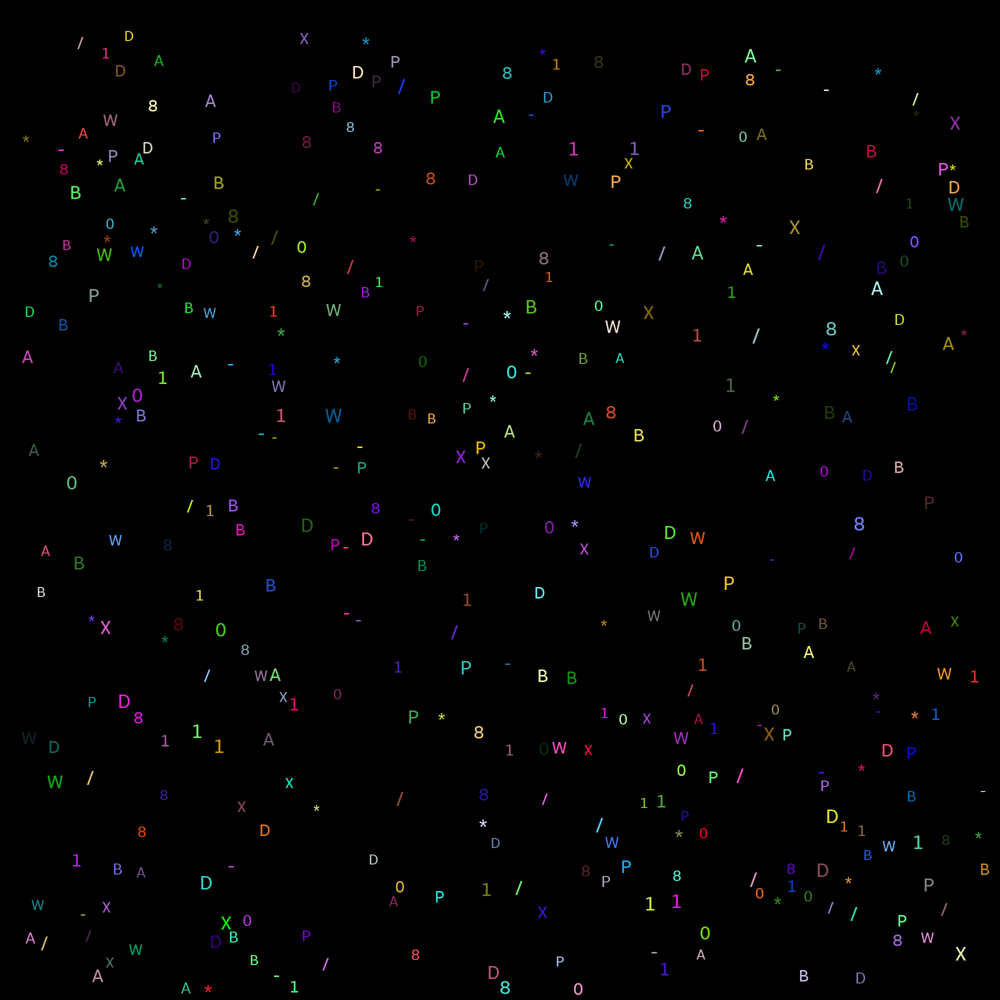

Написать программу для составления частотного словаря символов на изображении symbols.png из алфавита alphabet_ext.png. Программа должна выводить процент распознавания символов.

Результат:
```
Object number: 400
{None: 0, 'D': 31, 'X': 25, '/': 35, '*': 39, '1': 40, 'A': 35, 'P': 37, 'B': 61, '-': 31, 'W`': 26, '0': 30, '8': 10}
Accuracy: 100.0
```

Символы: 


Symbols.png:
